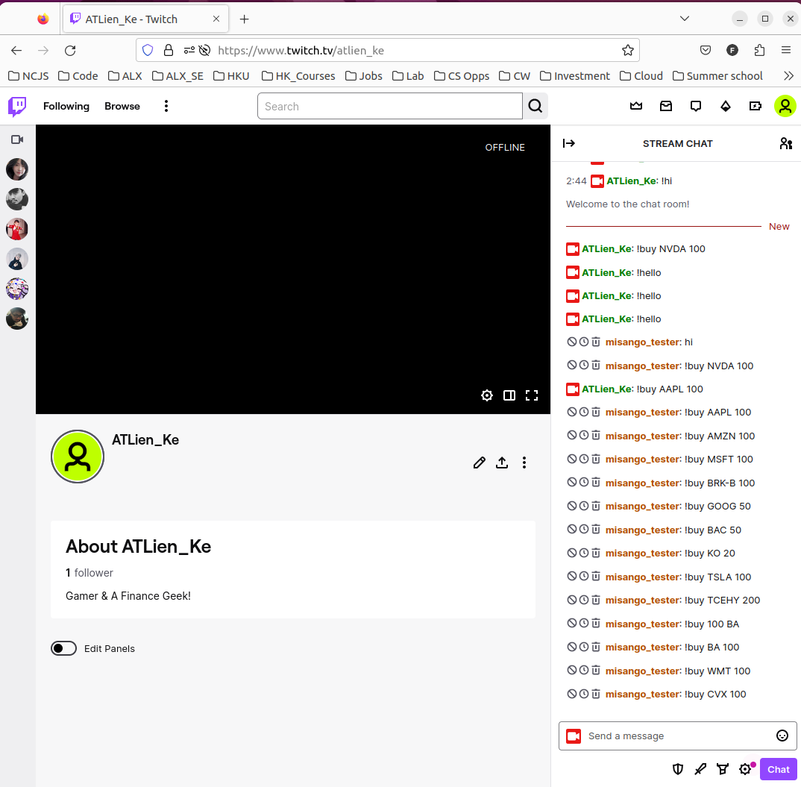
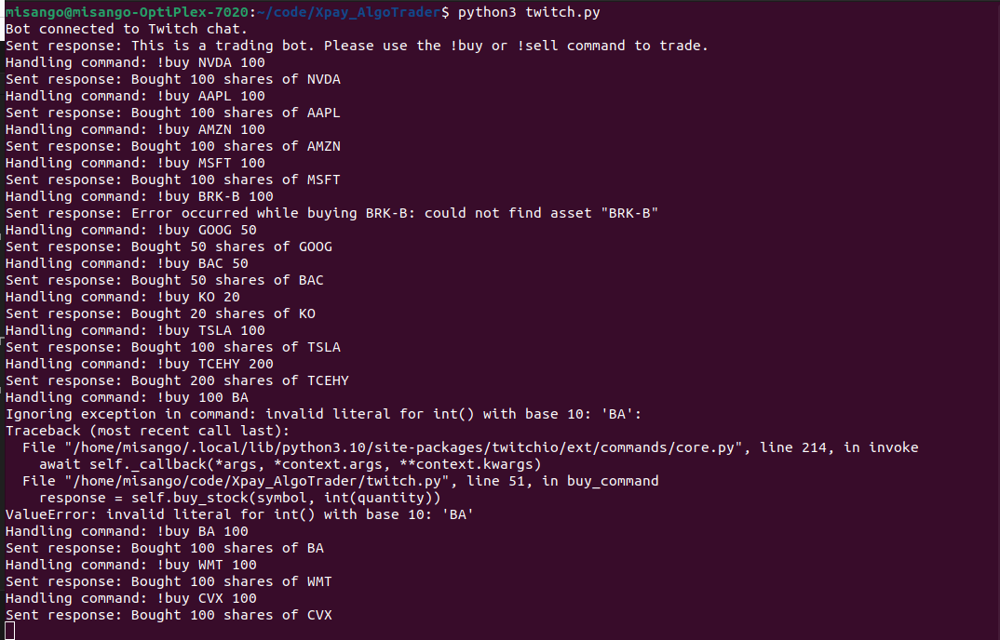

# Twitch-AlgoTrader
This Python project is quite complex and requires users to have at least basic understanding of Algorithmic Trading software structures and Finance. The project allows me to execute Novice Level Trades After considering recommendations from customized Algorithms modelled into web apps. I am a certified Financial Modelling Valuation Analyst (FMVA) from The Corporate Finance Institute & Intermediate Software Engineer that qualifies me to work on this project

## Softare Development
#### Software Development Cycle Architecture 

#### Application Programming Interface (APIs)
* Twitch APIs - These APIs are creating the Intertwined Twitch bot that allows my followers to Trade
* Alpaca Markets APIs -  These APIs allowed me to link my Application with my Paper Trading Account.   
#### Twitch Trading Bot
* This is the Twitch chat

* This is the response from terminal

#### Live Trade in Action Demo

## Installation - Twitch Testing 
* You need to create your own Twitch, Alpaca Markets and IEX cloud Accounts
* Clone this repo to your local Machine
* Run `pip install requirements.txt`
* Create a config.py and paste in that your `ALPACA API credentials` and `Twitch credentials` all specified in the twitch.py
* To start trading, run `python twitch.py` and observe `connected to bot` successfully
* Login to your own twitch account and in your chat, try `!buy STOCK_SYMBOL Number` replacing Stock symbol and the number
* To trade for my behalf lol, Follow me on Twitch `ATLien_ke` and join my message list when the chat & live stream opens, you can be allowed in

## Installation - INhouse Testing 
* create your own config file and append your own APIs 
* Refer to my repo, Lumibots for automation 