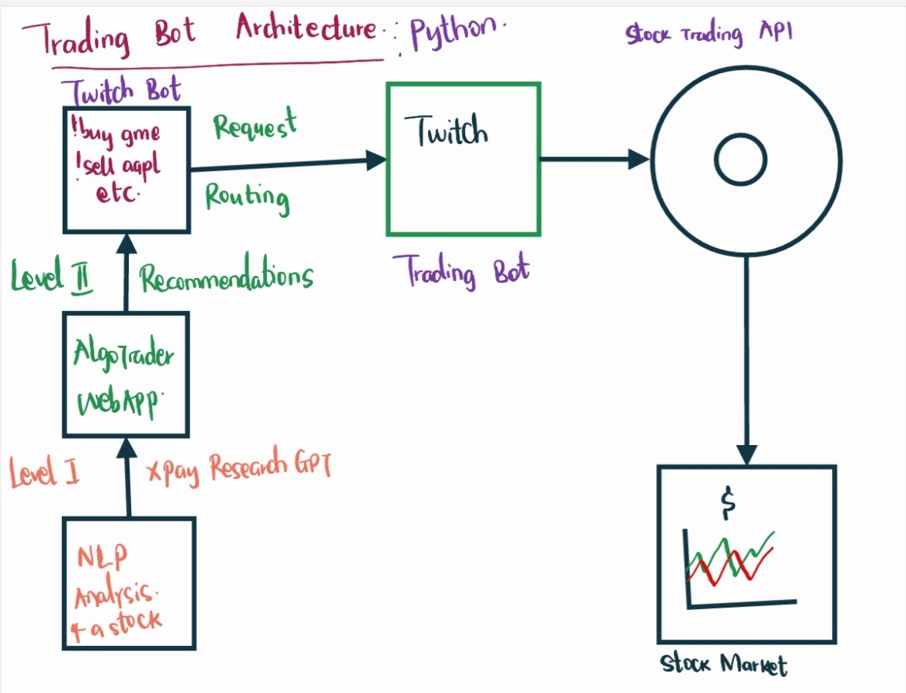
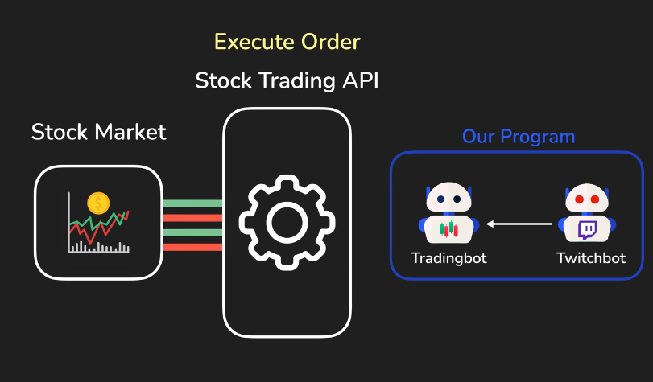
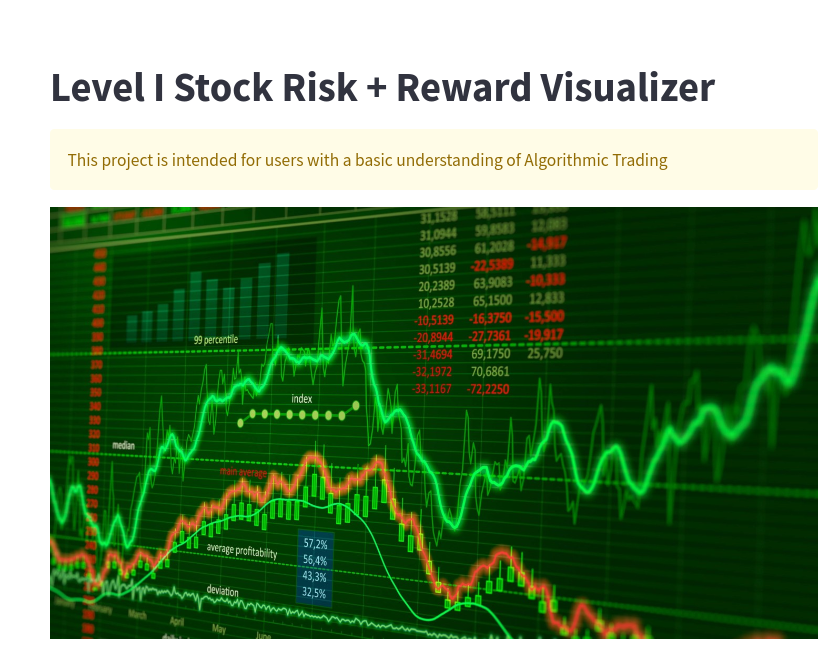
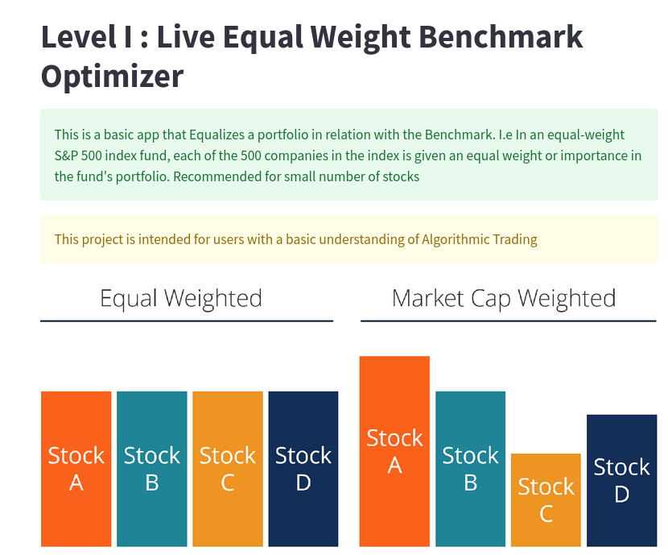
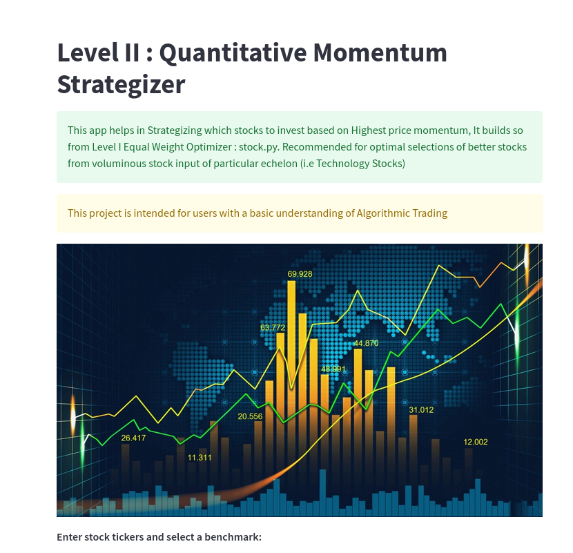
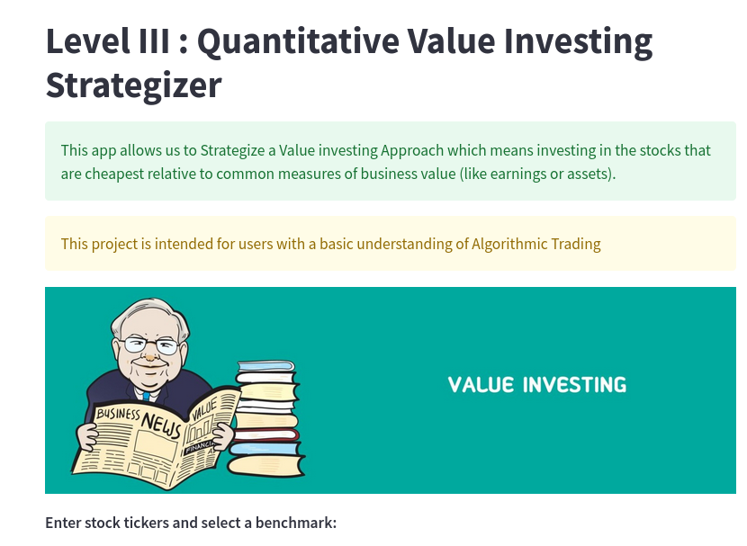
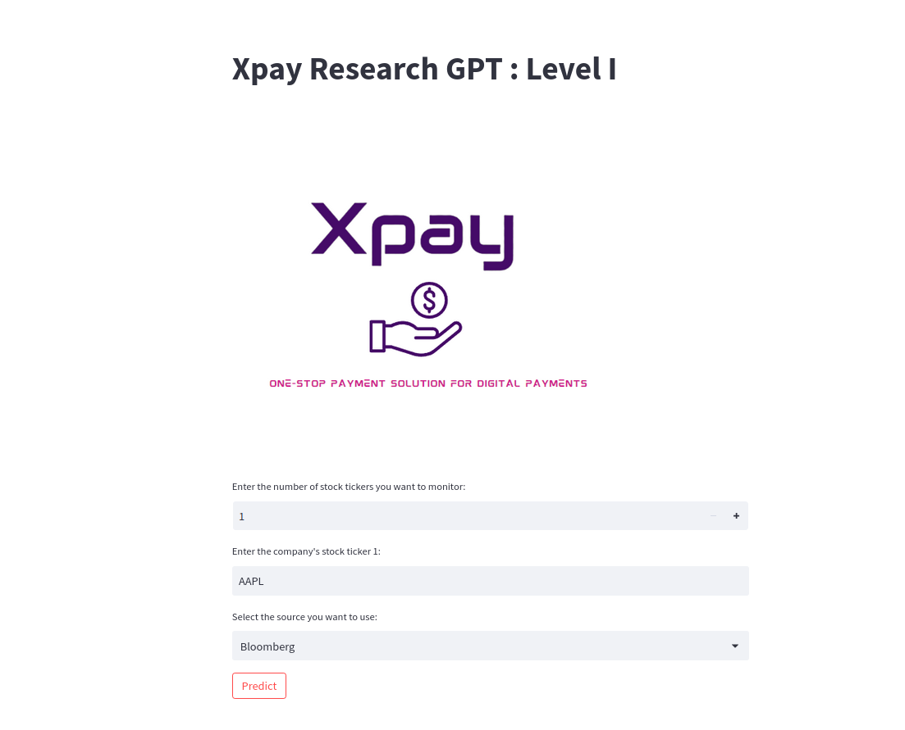

# Xpay_AlgoTrader
This Python project is quite complex and requires users to have at least basic understanding of Algorithmic Trading software structures and Finance. The project allows me to execute Novice Level Trades After considering recommendations from customized Algorithms modelled into web apps. I am a certified Financial Modelling Valuation Analyst (FMVA) from The Corporate Finance Institute & Intermediate Software Engineer that qualifies me to work on this project

## Softare Development
#### Software Development Cycle Architecture 

#### Web Trading Software 

#### Recommendation Algorithms
* Foremost, I run the Level I stock Visualizer to get a history of the closing price of the stock (Customized Graphs)

* Second, I run the Level I Equal Weight Benchmark Optimizer that re-weights stocks in my prospective portfolio to match the benchmark and give me an overview of how much stocks I should but

* Third, I run the Level II Quantitative Momentum strategizer to see which of those stocks has had the highest price change volatility. The higher the stock has been going, the better

* Fourth, I run the level III value investing application to strategize on the best optimal stock based on the assets. If a company has much more assets than the stock market price, I can tell its undervalued and choose to invest to invest

* To get the current Expertise opinion on how the stock is doing, I have my own customized BERT & BART NLP Application that generates Sentiment analysis for that particular stock ticker news. I run it live when I am doing my Algorithmic analysis You can  and test it

#### Application Programming Interface (APIs)
* IEX cloud Free API - For Fetching stock information , stats and quotation values. [Get it here](https://iexcloud.io/)
#### Live Trade in Action Demo

## Installation
* Clone this repo to your local Machine
* Run `pip install requirements.txt`
* Create a secrets_1.py and write in that `IEX_CLOUD_API_TOKEN = YOUR_IEX_CLOUD_API`
* Run `streamlit run stock.py` and do the same for `Equal.py , value.py, quantitative.py`